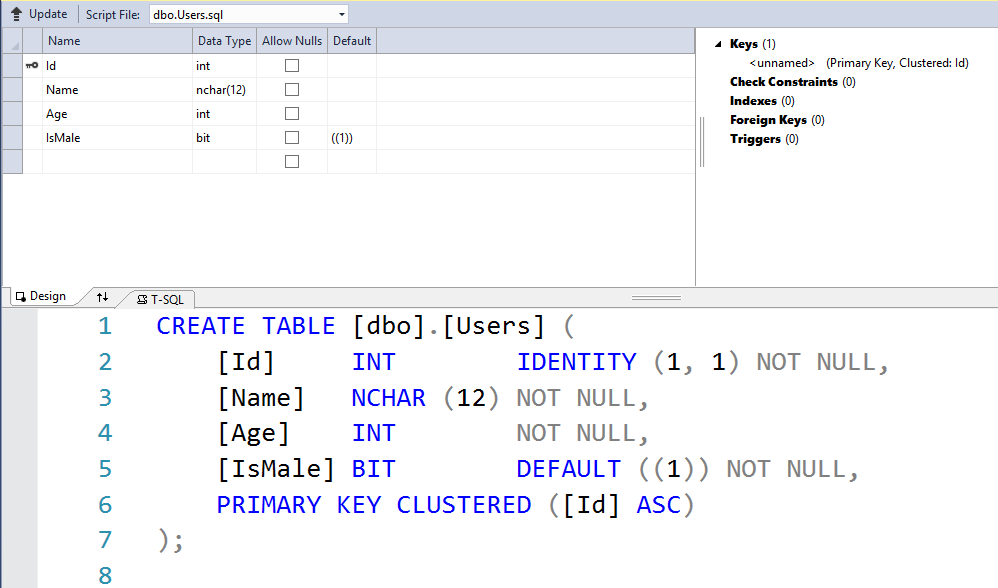

# N-Tier model (web api + ef)

* `DB` (local db)

Tiers:
* `DAL`
    * ef - refernces to: `DB`
* `BOL`
* `BLL`
    * refernces to: `DAL` , `BOL`
* `UIL`
    * refernces to: `BLL` , `BOL`

*NOTE:*    
* Add to `BLL`and `UIL` the `EF package` (from nuget package manager)
* Copy the `connection string` from the `app.config` in the `DAL` to the `web.config` in the `UIL`

## Converting between `DAL model` and `BOL model`
In this part, we will use this aliases:
* EF Models- `x1`
* BOL Models- `x2`

#### Which model can be accessed each tier
* `DAL`  - can use only `x1`
* `BLL`  - can use `x1` `x2`
* `UIL`  - can use only `x2`

#### Pass data from UIL to DAL
* When the client sends a new user - UIL gets it as `x2`
* UIL passes the `x2` user to BLL
* BLL converts `x2` user to `x1` user and sends this `x1` user to the DAL

#### Pass data from DAL to UIL
* When the client sends a `GET` request to the UIL 
* UIL passes the request to BLL
* BLL reads from DAL the `x1` users, converts them to `x2` users and sends this `x2` users to the UIL

# Code of each tier

### DAL
###### The `DAL` was created with ef6, main code parts are:
```csharp
// </auto-generated>
namespace _00_DAL
{
    using System;
    using System.Data.Entity;
    using System.Data.Entity.Infrastructure;
    
    public partial class DatabaseEntities : DbContext
    {
        public DatabaseEntities()
            : base("name=DatabaseEntities")
        {
        }
    
        protected override void OnModelCreating(DbModelBuilder modelBuilder)
        {
            throw new UnintentionalCodeFirstException();
        }
    
        public virtual DbSet<Users> Users { get; set; }
    }
}

// </auto-generated>
namespace _00_DAL
{
    using System;
    using System.Collections.Generic;
    
    public partial class Users
    {
        public int Id { get; set; }
        public string Name { get; set; }
        public int Age { get; set; }
        public bool IsMale { get; set; }
    }
}
```


### BOL
```csharp
using _02_BOL.Validations;
using System.ComponentModel;
using System.ComponentModel.DataAnnotations;

namespace _01_BOL
{
    public class User
    {

        public int Id { get; set; }

        //4- 12 chars
        //requierd
        [Required]
        [MinLength(4), MaxLength(12)]
        public string UserName { get; set; }

        //default is true
        [DefaultValue(true)]
        public bool IsMale { get; set; }

        //If user is male - min value is 18
        //If user is women - min value is 20
        //For both - max is 120
        [RangeAge]
        public int Age { get; set; }

    }
}

```
```csharp
using System;
using System.ComponentModel.DataAnnotations;
using System.Reflection;

namespace _02_BOL.Validations
{
    public class RangeAgeAttribute : ValidationAttribute
    {
        override protected ValidationResult IsValid(object value, ValidationContext validationContext)
        {
            object instance = validationContext.ObjectInstance;
            Type type = instance.GetType();
            PropertyInfo property = type.GetProperty("IsMale");
            object propertyValue = property.GetValue(instance);
            Boolean.TryParse(propertyValue.ToString(), out bool isMale);

            return ((isMale && (int)value >= 18 || (int)value >= 20) && (int)value <= 120) ? null :
                new ValidationResult("Min age:" + (isMale ? 18 : 20) + ", Max age: 120");
        }
    }
}
```

### BLL
```csharp
using _00_DAL;
using _01_BOL;
using System.Collections.Generic;
using System.Linq;

namespace _02_BLL
{
    public static class LogicManager
    {

        public static List<User> GetAllUsers()
        {
            using (DatabaseEntities db = new DatabaseEntities())
            {
                return db.Users.Select(u => (new User
                {
                    Id = u.Id,
                    UserName = u.Name,
                    IsMale = u.IsMale,
                    Age = u.Age
                })).ToList();
            }

        }

        public static string GetUserName(int id)
        {
            using (DatabaseEntities db = new DatabaseEntities())
            {
                Users dbUser = db.Users.FirstOrDefault(u => u.Id == id);
                return (dbUser == null) ? null : dbUser.Name;

            }
        }

        public static bool RemoveUser(int id)
        {

            using (DatabaseEntities db = new DatabaseEntities())
            {
                Users dbUser = db.Users.FirstOrDefault(u => u.Id == id);
                if (dbUser == null)
                    return false;

                db.Users.Remove(dbUser);


                try
                {
                    db.SaveChanges();
                    return true;
                }
                catch
                {
                    return false;
                }

            }
        }

        public static bool UpdateUser(User user)
        {
            using (DatabaseEntities db = new DatabaseEntities())
            {
                Users dbUser = db.Users.FirstOrDefault(u => u.Id == user.Id);

                if (dbUser == null)
                    return false;

                dbUser.Name = user.UserName;
                dbUser.Age = user.Age;
                dbUser.IsMale = user.IsMale;

                try
                {
                    db.SaveChanges();
                    return true;
                }
                catch
                {
                    return false;
                }
            }
        }

        public static bool AddUser(User user)
        {
            using (DatabaseEntities db = new DatabaseEntities())
            {
                db.Users.Add(new Users
                {
                    Id = user.Id,
                    Name = user.UserName,
                    IsMale = user.IsMale,
                    Age = user.Age
                });

                try
                {
                    db.SaveChanges();
                    return true;
                }
                catch
                {
                    return false;
                }
            }


        }
    }
}

```


### UIL
```csharp
using _01_BOL;
using _02_BLL;

using System;
using System.Collections.Generic;
using System.Net;
using System.Net.Http;
using System.Net.Http.Formatting;
using System.Web.Http;

namespace _03_uil.Controllers
{
    public class UsersController : ApiController
    {
        // GET: api/Users
        public HttpResponseMessage Get()
        {
            return new HttpResponseMessage(HttpStatusCode.OK)
            {
                Content = new ObjectContent<List<User>>(LogicManager.GetAllUsers(), new JsonMediaTypeFormatter())
            };
        }

        // GET: api/Users/5
        public HttpResponseMessage Get(int id)
        {
            return new HttpResponseMessage(HttpStatusCode.OK)
            {
                Content = new ObjectContent<String>(LogicManager.GetUserName(id), new JsonMediaTypeFormatter())
            };
        }

        // POST: api/Users
        public HttpResponseMessage Post([FromBody]User value)
        {
            if (ModelState.IsValid)
            {
                return (LogicManager.AddUser(value)) ?
                   new HttpResponseMessage(HttpStatusCode.Created) :
                   new HttpResponseMessage(HttpStatusCode.BadRequest)
                   {
                       Content = new ObjectContent<String>("Can not add to DB", new JsonMediaTypeFormatter())
                   };
            };

            List<string> ErrorList = new List<string>();

            //if the code reached this part - the user is not valid
            foreach (var item in ModelState.Values)
                foreach (var err in item.Errors)
                    ErrorList.Add(err.ErrorMessage);

            return new HttpResponseMessage(HttpStatusCode.BadRequest)
            {
                Content = new ObjectContent<List<string>>(ErrorList, new JsonMediaTypeFormatter())
            };

        }

        // PUT: api/Users/5
        public HttpResponseMessage Put([FromBody]User value)
        {

            if (ModelState.IsValid)
            {
                return (LogicManager.UpdateUser(value)) ?
                    new HttpResponseMessage(HttpStatusCode.OK) :
                    new HttpResponseMessage(HttpStatusCode.BadRequest)
                    {
                        Content = new ObjectContent<String>("Can not update in DB", new JsonMediaTypeFormatter())
                    };
            };

            List<string> ErrorList = new List<string>();

            //if the code reached this part - the user is not valid
            foreach (var item in ModelState.Values)
                foreach (var err in item.Errors)
                    ErrorList.Add(err.ErrorMessage);

            return new HttpResponseMessage(HttpStatusCode.BadRequest)
            {
                Content = new ObjectContent<List<string>>(ErrorList, new JsonMediaTypeFormatter())
            };
        }

        // DELETE: api/Users/5
        public HttpResponseMessage Delete(int id)
        {
            return (LogicManager.RemoveUser(id)) ?
                    new HttpResponseMessage(HttpStatusCode.OK) :
                    new HttpResponseMessage(HttpStatusCode.BadRequest)
                    {
                        Content = new ObjectContent<String>("Can not remove from DB", new JsonMediaTypeFormatter())
                    };
        }
    }
}

```


# Test api with `curl`

### Get Request
```
curl -X GET -v http://localhost:60762/api/users
```

```
> GET /api/users HTTP/1.1
> Host: localhost:60762
> User-Agent: curl/7.61.0
> Accept: */*
>
< HTTP/1.1 200 OK
< Cache-Control: no-cache
< Pragma: no-cache
< Content-Type: application/json; charset=utf-8
< Expires: -1
< Server: Microsoft-IIS/10.0
< X-AspNet-Version: 4.0.30319
< X-Powered-By: ASP.NET
< Date: Mon, 15 Oct 2018 06:30:15 GMT
< Content-Length: 60
<
[{"Id":1,"UserName":"Test","IsMale":false,"Age":22}]
```

### Post Request (not valid data)
```
curl -v -X POST -H "Content-type: application/json" -d "{\"UserName\":\"Test2\", \"Age\":\"13\",\"IsMale\":\"True\"}"  http://localhost:60762/api/users
```

```
* Connected to localhost (::1) port 60762 (#0)
> POST /api/users HTTP/1.1
> Host: localhost:60762
> User-Agent: curl/7.61.0
> Accept: */*
> Content-type: application/json
> Content-Length: 48
>
* upload completely sent off: 48 out of 48 bytes
< HTTP/1.1 400 Bad Request
< Cache-Control: no-cache
< Pragma: no-cache
< Content-Type: application/json; charset=utf-8
< Expires: -1
< Server: Microsoft-IIS/10.0
< X-AspNet-Version: 4.0.30319
< X-Powered-By: ASP.NET
< Date: Mon, 15 Oct 2018 06:32:48 GMT
< Content-Length: 28
<
["Min age:18, Max age: 120"]
```

### Post Request (not valid data)

```
curl -v -X POST -H "Content-type: application/json" -d "{\"UserName\":\"Test2\", \"Age\":\"18\",\"IsMale\":\"False\"}"  http://localhost:60762/api/users
```
```
> POST /api/users HTTP/1.1
> Host: localhost:60762
> User-Agent: curl/7.61.0
> Accept: */*
> Content-type: application/json
> Content-Length: 46
>
* upload completely sent off: 46 out of 46 bytes
< HTTP/1.1 400 Bad Request
< Cache-Control: no-cache
< Pragma: no-cache
< Content-Type: application/json; charset=utf-8
< Expires: -1
< Server: Microsoft-IIS/10.0
< X-AspNet-Version: 4.0.30319
< X-Powered-By: ASP.NET
< Date: Mon, 15 Oct 2018 06:33:21 GMT
< Content-Length: 141
<
["Min age:20, Max age: 120"]

```

### Post Request (valid data - ADDED NEW USER)

```
curl -v -X POST -H "Content-type: application/json" -d "{\"UserName\":\"Test2\", \"Age\":\"18\",\"IsMale\":\"True\"}"  http://localhost:60762/api/users
```
```
> POST /api/users HTTP/1.1
> Host: localhost:60762
> User-Agent: curl/7.61.0
> Accept: */*
> Content-type: application/json
> Content-Length: 48
>
* upload completely sent off: 48 out of 48 bytes
< HTTP/1.1 201 Created
< Cache-Control: no-cache
< Pragma: no-cache
< Expires: -1
< Server: Microsoft-IIS/10.0
< X-AspNet-Version: 4.0.30319
< X-Powered-By: ASP.NET
< Date: Mon, 15 Oct 2018 06:35:38 GMT
< Content-Length: 0
```


### Get Request (will return also the new user)
```
curl -X GET -v http://localhost:60762/api/users
```
```
> GET /api/users HTTP/1.1
> Host: localhost:60762
> User-Agent: curl/7.61.0
> Accept: */*
>
< HTTP/1.1 200 OK
< Cache-Control: no-cache
< Pragma: no-cache
< Content-Type: application/json; charset=utf-8
< Expires: -1
< Server: Microsoft-IIS/10.0
< X-AspNet-Version: 4.0.30319
< X-Powered-By: ASP.NET
< Date: Mon, 15 Oct 2018 06:36:33 GMT
< Content-Length: 118
<
[{"Id":1,"UserName":"Test","IsMale":false,"Age":22},{"Id":2,"UserName":"Test2","IsMale":true,"Age":18}]
```


### Put Request (not valid data)
```
curl -v -X PUT -H "Content-type: application/json" -d "{\"Id\":\"2\", \"UserName\":\"Test3\", \"Age\":\"17\",\"IsMale\":\"False\"}"  http://localhost:60762/api/users
```

```
> PUT /api/users HTTP/1.1
> Host: localhost:60762
> User-Agent: curl/7.61.0
> Accept: */*
> Content-type: application/json
> Content-Length: 59
>
* upload completely sent off: 59 out of 59 bytes
< HTTP/1.1 400 Bad Request
< Cache-Control: no-cache
< Pragma: no-cache
< Content-Type: application/json; charset=utf-8
< Expires: -1
< Server: Microsoft-IIS/10.0
< X-AspNet-Version: 4.0.30319
< X-Powered-By: ASP.NET
< Date: Mon, 15 Oct 2018 06:39:35 GMT
< Content-Length: 28
<
["Min age:20, Max age: 120"]
```

### Put Request (valid data - EDITED USER)
```
curl -v -X PUT -H "Content-type: application/json" -d "{\"Id\":\"2\", \"UserName\":\"Test3\", \"Age\":\"30\",\"IsMale\":\"False\"}"  http://localhost:60762/api/users
```

```
> PUT /api/users HTTP/1.1
> Host: localhost:60762
> User-Agent: curl/7.61.0
> Accept: */*
> Content-type: application/json
> Content-Length: 59
>
* upload completely sent off: 59 out of 59 bytes
< HTTP/1.1 200 OK
< Cache-Control: no-cache
< Pragma: no-cache
< Expires: -1
< Server: Microsoft-IIS/10.0
< X-AspNet-Version: 4.0.30319
< X-Powered-By: ASP.NET
< Date: Mon, 15 Oct 2018 06:40:42 GMT
< Content-Length: 0
```


### Get Request (will return also the edited user)

```
curl -X GET -v http://localhost:60762/api/users
```

```
> GET /api/users HTTP/1.1
> Host: localhost:60762
> User-Agent: curl/7.61.0
> Accept: */*
>
< HTTP/1.1 200 OK
< Cache-Control: no-cache
< Pragma: no-cache
< Content-Type: application/json; charset=utf-8
< Expires: -1
< Server: Microsoft-IIS/10.0
< X-AspNet-Version: 4.0.30319
< X-SourceFiles: =?UTF-8?B?QzpcVXNlcnNcc2VsZGF0XERlc2t0b3BcMDJfTlRpZXJzXDAzX3VpbFxhcGlcdXNlcnM=?=
< X-Powered-By: ASP.NET
< Date: Mon, 15 Oct 2018 06:41:14 GMT
< Content-Length: 118
<
[{"Id":1,"UserName":"Test","IsMale":false,"Age":22},{"Id":2,"UserName":"Test3","IsMale":true,"Age":30}]
```


### Delete Request (not valid id)
```
curl -X DELETE -v http://localhost:60762/api/users?id=3
```

```
> DELETE /api/users?id=3 HTTP/1.1
> Host: localhost:60762
> User-Agent: curl/7.61.0
> Accept: */*
>
< HTTP/1.1 400 Bad Request
< Cache-Control: no-cache
< Pragma: no-cache
< Content-Type: application/json; charset=utf-8
< Expires: -1
< Server: Microsoft-IIS/10.0
< X-AspNet-Version: 4.0.30319
< X-Powered-By: ASP.NET
< Date: Mon, 15 Oct 2018 06:44:38 GMT
< Content-Length: 24
<
"Can not remove from DB"
```
### Delete Request (valid id - REMOVED USER)

```
curl -X DELETE -v http://localhost:60762/api/users?id=1
```
```
> DELETE /api/users?id=1 HTTP/1.1
> Host: localhost:60762
> User-Agent: curl/7.61.0
> Accept: */*
>
< HTTP/1.1 200 OK
< Cache-Control: no-cache
< Pragma: no-cache
< Expires: -1
< Server: Microsoft-IIS/10.0
< X-AspNet-Version: 4.0.30319
< X-Powered-By: ASP.NET
< Date: Mon, 15 Oct 2018 06:45:23 GMT
< Content-Length: 0
```

### Get Request (will not return the removed user)
```
curl -X GET -v http://localhost:60762/api/users
```
```
> GET /api/users HTTP/1.1
> Host: localhost:60762
> User-Agent: curl/7.61.0
> Accept: */*
>
< HTTP/1.1 200 OK
< Cache-Control: no-cache
< Pragma: no-cache
< Content-Type: application/json; charset=utf-8
< Expires: -1
< Server: Microsoft-IIS/10.0
< X-AspNet-Version: 4.0.30319
< X-Powered-By: ASP.NET
< Date: Mon, 15 Oct 2018 06:46:22 GMT
< Content-Length: 59
<
[{"Id":2,"UserName":"Test3","IsMale":true,"Age":30}]

```
